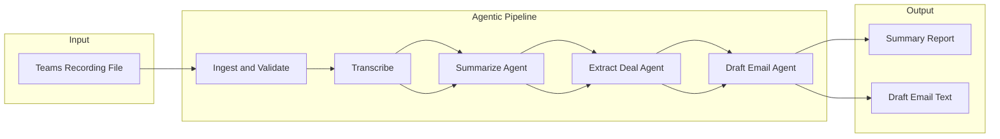

user:
<user_query>
	I have a Microsoft teams call recording with the customer where we discussed about their adoption of Mindtap for Biology. I want to summarize the call and send an email to my manager to talk about the deal and possible discount offerings as they are already using Pearson's solution for Biology. I want to automate this solution with an agentic AI to eliminate manual effort. Suggest an idea and technical implementation plan
</user_query>

assistant:
Clarifying a few details so we can propose a concrete agentic AI design and implementation plan:
[Tool call] AskQuestion
  title: Automation scope and environment
  questions: [{"id":"trigger","prompt":"How should the workflow be triggered?","options":[{"id":"manual","label":"Manual: I run it after uploading or linking the recording (e.g. script/UI)"},{"id":"auto_folder","label":"Automatic: Run when a new recording appears in a specific folder (OneDrive/SharePoint)"},{"id":"unsure","label":"Not sure yet – suggest the best option"}]},{"id":"email_action","prompt":"What should the agent do with the email to your manager?","options":[{"id":"draft_only","label":"Draft only: Generate the email for me to review and send"},{"id":"send_after_review","label":"Draft and queue: Create draft in Outlook for me to approve then send"},{"id":"send_auto","label":"Send automatically: Send the email without my review (with optional BCC/backup)"}]},{"id":"stack","prompt":"Do you have a preferred tech stack or existing infrastructure?","options":[{"id":"python_azure","label":"Python + Azure (OpenAI/Azure OpenAI, Azure Functions, etc.)"},{"id":"python_local","label":"Python locally (scripts, optional cloud APIs only for AI/email)"},{"id":"microsoft","label":"Microsoft ecosystem (Power Automate, Logic Apps, Graph API)"},{"id":"flexible","label":"No preference – recommend the best fit"}]}]

[Tool result] AskQuestion

assistant:
Creating a concise technical plan for an agentic AI that ingests the recording, transcribes it, summarizes the call, extracts deal/discount points, and drafts an email for you to review—all triggered manually and implemented in Python locally.
[Tool call] CreatePlan
  name: Teams Call Summary Agent
  overview: Design and implement a local Python-based agentic AI that: (1) takes a Teams call recording as input, (2) transcribes it, (3) summarizes the call and extracts deal/discount insights using an LLM, and (4) produces a draft email to your manager—all with minimal manual steps and no auto-send.
  plan: # Teams Call Summary and Manager Email Draft – Agentic AI Plan

## Goal

Automate: **Teams recording → transcription → summary + deal/discount extraction → draft email to manager**, with a **manual trigger** and **draft-only** email output, using **Python locally** and cloud APIs only where needed (transcription, LLM).

---

## High-Level Architecture

- **Ingest**: Accept path to recording file (e.g. `.mp4`, `.webm` from Teams); validate format and size.
- **Transcribe**: Speech-to-text (local Whisper or cloud API).
- **Summarize agent**: LLM summarizes call (context: Mindtap for Biology, Pearson adoption).
- **Extract deal agent**: LLM extracts deal status, discount needs, and “already using Pearson Biology” angle.
- **Draft email agent**: LLM produces a professional draft to your manager with summary + deal + discount suggestions.
- **Output**: Summary + draft email as files (and optionally copy to clipboard or create Outlook draft).

---

## Agentic Design

- **Single orchestrator script** that runs the pipeline; each “agent” is a focused LLM call with a system prompt and structured output (or simple JSON/text).
- **Prompt design**:
  - **Summarize**: “Summarize this sales call about Mindtap for Biology. Include: who was on the call, main topics, customer’s current use of Pearson Biology, and any objections or questions.”
  - **Extract**: “From this summary/transcript, list: (1) deal stage/interest level, (2) discount or pricing requests, (3) reasons they are a good fit (existing Pearson Biology).”
  - **Draft email**: “Write a short email to my manager with: call summary, deal potential, and suggested discount/offerings given they already use Pearson for Biology. Tone: professional, concise.”
- **Optional**: Use a single “super-agent” LLM call that does summary + extraction + email in one go with a long prompt and sections in the response (simpler to ship first).

---

## Technical Implementation

### 1. Stack and dependencies

| Concern | Choice | Rationale |
|--------|--------|-----------|
| Language | Python 3.10+ | Local-first, good ecosystem for media and LLMs. |
| Transcription | **OpenAI Whisper** (local) or **faster-whisper** | Works offline; supports common Teams export formats. Alternative: **Azure Speech** or **AssemblyAI** if you prefer cloud. |
| LLM | **OpenAI API** or **Azure OpenAI** | Easiest for structured prompts. Optional: **Ollama** (local) for full privacy. |
| Orchestration | Single Python script or a small CLI (e.g. `python run_pipeline.py --recording path/to/file.mp4`) | Fits “manual run” requirement. |
| Config | `.env` for API keys; optional `config.yaml` for manager name, product names, email template hints | Keeps keys and preferences out of code. |

### 2. Project layout (suggested)

- `run_pipeline.py` – entrypoint: parse args, run ingest → transcribe → summarize → extract → draft email, write outputs.
- `ingest.py` – validate file path, optional conversion (e.g. to format Whisper likes).
- `transcribe.py` – call Whisper (or cloud); return full transcript text.
- `agents/` (or inline in one module):
  - `summarize.py` – prompt + LLM call for summary.
  - `extract_deal.py` – prompt + LLM call for deal/discount points.
  - `draft_email.py` – prompt + LLM call for manager email draft.
- `output.py` – write summary and email to files; optional: clipboard, Outlook draft via `pywin32` on Windows.
- `config.example.env`, `requirements.txt`, `README.md`.

### 3. Data flow

1. **Input**: `--recording path/to/recording.mp4` (and optionally `--output-dir`).
2. **Transcription**: Audio extracted if needed (e.g. `ffmpeg` or `pydub`); Whisper returns transcript.
3. **LLM steps**: Transcript (and optionally summary) passed into each agent; outputs are strings or small dicts.
4. **Output**:  
   - `call_summary_YYYYMMDD_HHMM.txt` – summary + deal/discount bullets.  
   - `draft_email_to_manager_YYYYMMDD_HHMM.txt` – ready to paste or load into Outlook.

Optional: `--open-outlook-draft` to create an Outlook draft (Windows) so you only need to review and send.

### 4. Security and privacy

- **Secrets**: Store API keys in `.env`; never commit. Use `python-dotenv`.
- **Data**: Transcript and summary may contain customer info; keep output files in a local folder and exclude from version control.
- **Compliance**: Document that this is for internal use; no auto-sending; you control what is shared with your manager.

### 5. Implementation order

1. **Project setup**: repo, `requirements.txt` (e.g. `openai-whisper` or `faster-whisper`, `openai`, `python-dotenv`, `pydub` if needed), `.env.example`.
2. **Ingest + transcribe**: Support one Teams recording format (e.g. `.mp4`); produce transcript.
3. **Single LLM agent**: One script that takes transcript and outputs (a) summary, (b) deal/discount bullets, (c) email draft (sections in one response).
4. **Output**: Write summary and email to timestamped files in an `output/` directory.
5. **CLI polish**: `--recording`, `--output-dir`, `--model`; basic error messages.
6. **Optional**: Split into three small agents (summarize / extract / draft) for clarity; optional Outlook draft creation on Windows.

---

## Suggested `requirements.txt` (minimal)

- `openai` (for Whisper API or Chat Completions; or use local Whisper and only Chat for agents)
- `faster-whisper` or `openai-whisper` (local transcription)
- `python-dotenv`
- `pydub` (if you need to normalize audio)
- Optional: `pywin32` for Outlook draft on Windows

---

## Success Criteria

- You run one command with the path to the Teams recording.
- You get a short call summary and a draft email to your manager mentioning the deal and discount options given existing Pearson Biology use.
- No email is sent automatically; you review and send yourself.
- API keys and output files stay local and under your control.

This gives you a clear path to an agentic, manual-trigger, draft-only automation that fits your stack and privacy requirements.

[Tool result] CreatePlan

user:
<user_query>
Change the plan to analyze the content and should not be specific to Mindtap for biology
</user_query>

assistant:
[Tool call] Read
  path: c:\Users\patha\.cursor\plans\teams_call_summary_agent_e41db242.plan.md

[Tool result] Read

assistant:
Updating the plan to be content-agnostic so the agent analyzes whatever is discussed in the call, not just Mindtap for Biology or Pearson.
[Tool call] StrReplace
  path: c:\Users\patha\.cursor\plans\teams_call_summary_agent_e41db242.plan.md
  old_string: overview: "Design and implement a local Python-based agentic AI that: (1) takes a Teams call recording as input, (2) transcribes it, (3) summarizes the call and extracts deal/discount insights using an LLM, and (4) produces a draft email to your manager—all with minimal manual steps and no auto-send."
  new_string: overview: "Design and implement a local Python-based agentic AI that: (1) takes a Teams call recording as input, (2) transcribes it, (3) analyzes the content to summarize the call and extract deal/discount insights using an LLM, and (4) produces a draft email to your manager—generic to any call topic, with minimal manual steps and no auto-send."
[Tool call] StrReplace
  path: c:\Users\patha\.cursor\plans\teams_call_summary_agent_e41db242.plan.md
  old_string: # Teams Call Summary and Manager Email Draft – Agentic AI Plan

## Goal

Automate: **Teams recording → transcription → summary + deal/discount extraction → draft email to manager**, with a **manual trigger** and **draft-only** email output, using **Python locally** and cloud APIs only where needed (transcription, LLM).
  new_string: # Teams Call Summary and Manager Email Draft – Agentic AI Plan

## Goal

Automate: **Teams recording → transcription → content analysis (summary + deal/discount extraction) → draft email to manager**, with a **manual trigger** and **draft-only** email output, using **Python locally** and cloud APIs only where needed (transcription, LLM). The pipeline **analyzes the call content generically**—no hard-coded product or customer context; it infers topics, products, and deal angles from the transcript.
[Tool call] StrReplace
  path: c:\Users\patha\.cursor\plans\teams_call_summary_agent_e41db242.plan.md
  old_string: - **Ingest**: Accept path to recording file (e.g. `.mp4`, `.webm` from Teams); validate format and size.
- **Transcribe**: Speech-to-text (local Whisper or cloud API).
- **Summarize agent**: LLM summarizes call (context: Mindtap for Biology, Pearson adoption).
- **Extract deal agent**: LLM extracts deal status, discount needs, and “already using Pearson Biology” angle.
- **Draft email agent**: LLM produces a professional draft to your manager with summary + deal + discount suggestions.
- **Output**: Summary + draft email as files (and optionally copy to clipboard or create Outlook draft).
  new_string: - **Ingest**: Accept path to recording file (e.g. `.mp4`, `.webm` from Teams); validate format and size.
- **Transcribe**: Speech-to-text (local Whisper or cloud API).
- **Summarize agent**: LLM analyzes the transcript and summarizes the call—participants, main topics, products/solutions discussed, customer context, and any objections or questions (all inferred from content).
- **Extract deal agent**: LLM extracts from the content: deal stage/interest level, discount or pricing requests, and reasons the customer is a good fit (e.g. existing relationship, current tools)—no product-specific assumptions.
- **Draft email agent**: LLM produces a professional draft to your manager with summary, deal potential, and suggested discount/offerings based on what was discussed in the call.
- **Output**: Summary + draft email as files (and optionally copy to clipboard or create Outlook draft).
[Tool call] StrReplace
  path: c:\Users\patha\.cursor\plans\teams_call_summary_agent_e41db242.plan.md
  old_string: ## Agentic Design

- **Single orchestrator script** that runs the pipeline; each “agent” is a focused LLM call with a system prompt and structured output (or simple JSON/text).
- **Prompt design**:
  - **Summarize**: “Summarize this sales call about Mindtap for Biology. Include: who was on the call, main topics, customer’s current use of Pearson Biology, and any objections or questions.”
  - **Extract**: “From this summary/transcript, list: (1) deal stage/interest level, (2) discount or pricing requests, (3) reasons they are a good fit (existing Pearson Biology).”
  - **Draft email**: “Write a short email to my manager with: call summary, deal potential, and suggested discount/offerings given they already use Pearson for Biology. Tone: professional, concise.”
- **Optional**: Use a single “super-agent” LLM call that does summary + extraction + email in one go with a long prompt and sections in the response (simpler to ship first).
  new_string: ## Agentic Design

- **Single orchestrator script** that runs the pipeline; each “agent” is a focused LLM call with a system prompt and structured output (or simple JSON/text). Prompts are **content-agnostic**: they instruct the model to analyze whatever was discussed, without assuming a specific product or customer.
- **Prompt design** (generic; model infers topics from the transcript):
  - **Summarize**: “Summarize this call based on the transcript. Include: who was on the call (if identifiable), main topics and products/solutions discussed, the customer’s current situation or existing tools (if mentioned), and any objections, questions, or next steps.”
  - **Extract**: “From this summary/transcript, list: (1) deal stage or interest level, (2) any discount or pricing requests, (3) reasons the customer is a good fit (e.g. existing relationship, current stack). Base everything on what was actually said—do not assume a specific product.”
  - **Draft email**: “Write a short email to my manager with: a brief call summary, deal potential, and suggested discount/offerings based on what was discussed. Keep tone professional and concise. Do not invent products or context not present in the call.”
- **Optional**: Use a single “super-agent” LLM call that does summary + extraction + email in one go with a long prompt and sections in the response (simpler to ship first).
[Tool call] StrReplace
  path: c:\Users\patha\.cursor\plans\teams_call_summary_agent_e41db242.plan.md
  old_string: | Config        | `.env` for API keys; optional `config.yaml` for manager name, product names, email template hints | Keeps keys and preferences out of code.                                                                                   |
  new_string: | Config        | `.env` for API keys; optional `config.yaml` for manager name, default email template hints (no product-specific defaults) | Keeps keys and preferences out of code; content is derived from each call.                                                 |
[Tool call] StrReplace
  path: c:\Users\patha\.cursor\plans\teams_call_summary_agent_e41db242.plan.md
  old_string: ## Success Criteria

- You run one command with the path to the Teams recording.
- You get a short call summary and a draft email to your manager mentioning the deal and discount options given existing Pearson Biology use.
- No email is sent automatically; you review and send yourself.
- API keys and output files stay local and under your control.

This gives you a clear path to an agentic, manual-trigger, draft-only automation that fits your stack and privacy requirements.
  new_string: ## Success Criteria

- You run one command with the path to the Teams recording.
- The pipeline analyzes the call content and produces a short summary plus a draft email to your manager with deal context and discount/offering suggestions based on what was actually discussed (any product or customer).
- No email is sent automatically; you review and send yourself.
- API keys and output files stay local and under your control.

This gives you a content-agnostic, agentic, manual-trigger, draft-only automation that fits your stack and privacy requirements.

[Tool result] StrReplace

[Tool result] StrReplace

[Tool result] StrReplace

[Tool result] StrReplace

[Tool result] StrReplace

[Tool result] StrReplace

assistant:
Summary of updates to the plan:

**Changes made**

1. **Goal and overview**  
   - The pipeline is described as **content-agnostic**: it analyzes whatever is in the call and infers topics, products, and deal angles from the transcript instead of assuming Mindtap/Pearson/Biology.

2. **Pipeline steps**  
   - **Summarize**: Summarizes participants, main topics, products/solutions discussed, and customer context—all inferred from the transcript.  
   - **Extract**: Pulls deal stage, discount/pricing requests, and fit reasons from what was said, with no product-specific assumptions.  
   - **Draft email**: Builds the manager email from what was actually discussed; no fixed product or customer framing.

3. **Prompt design**  
   - All three prompts are generic:  
     - Summarize: “Summarize this call based on the transcript…” and list what to include (participants, topics, products discussed, customer situation, objections/next steps).  
     - Extract: “From this summary/transcript, list…” and “Base everything on what was actually said—do not assume a specific product.”  
     - Draft email: “Based on what was discussed” and “Do not invent products or context not present in the call.”

4. **Config**  
   - Config is described as having no product-specific defaults; content is derived from each call.

5. **Success criteria**  
   - Success is defined as producing a summary and draft email “based on what was actually discussed (any product or customer)” and the solution is labeled “content-agnostic.”

The same architecture (ingest → transcribe → summarize → extract deal → draft email) and tech stack are kept; only the behavior is generalized so it works for any Teams call topic, not just Mindtap for Biology.